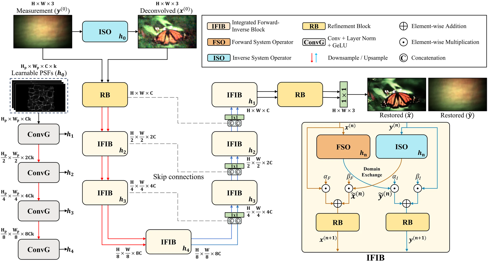
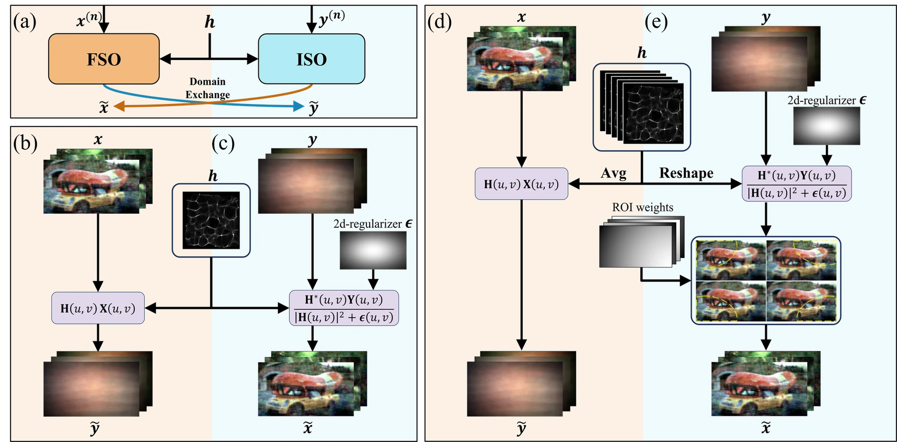
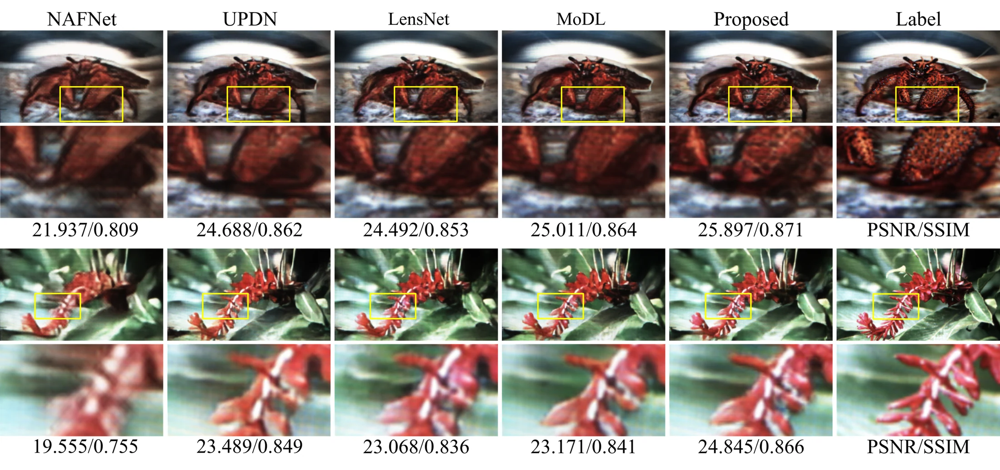
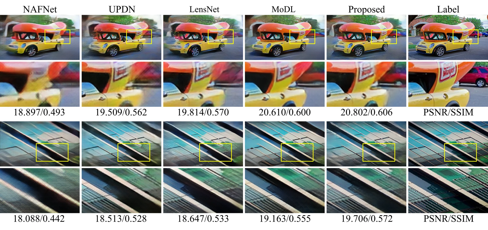
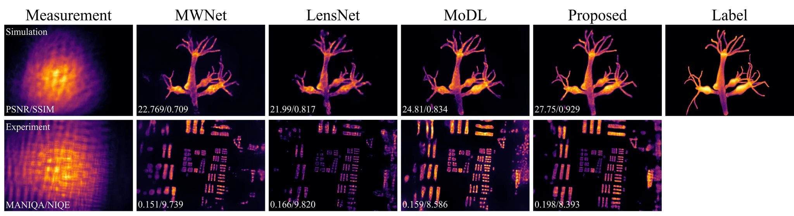
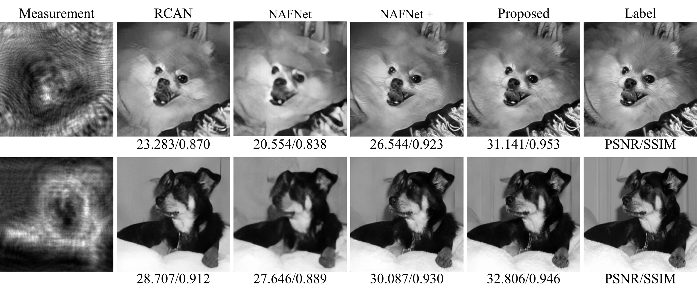

<div align="center">

# Integrated Forward-Inverse Network for Lensless Image Reconstruction

**Accepted to ECCV 2026**

Donggeon Bae<sup>1</sup>, Jaewoo Jung<sup>2,3</sup>, Yong Guk Kang<sup>2</sup>, Kyung Chul Lee<sup>4</sup>, Taeyoung Kim<sup>3</sup>, Jongho Kim<sup>1</sup>, Sangjun Byun<sup>1</sup>, Joonsik Park<sup>3</sup>, and Seung Ah Lee<sup>1,2</sup>

<sup>1</sup>Seoul National University, Department of Mechanical Engineering<br>
<sup>2</sup>Seoul National University, School of Mechanical and Aerospace Engineering/SNU-IAMD<br>
<sup>3</sup>Yonsei University, Department of Electrical and Electronic Engineering<br>
<sup>4</sup>University of Michigan, Department of Biomedical Engineering

<p>
  <a href="https://iilab.io/IFIN/"></a>
  <a href="https://iilab.io/IFIN/paper.html"></a>
  <a href="https://iilab.io/IFIN/supplement.html"></a>
  <a href="https://iilab.io/WiderCam"></a>
</p>

</div>

## Abstract

Lensless imaging enables compact and versatile computational cameras by replacing bulky optics with thin coded elements. However, reconstruction from the resulting measurements is challenging: large-footprint PSFs produce highly multiplexed observations, making inversion severely ill-conditioned and sensitive to calibration errors and model mismatch. While deep learning approaches, including hybrid models that incorporate physics priors, have shown promise, explicitly maintaining data fidelity throughout the network hierarchy remains difficult. Here, we propose the **Integrated Forward-Inverse Network (IFIN)**, a physics-guided architecture that interleaves differentiable forward projections with learnable inverse updates at every stage, enabling complementary cues to be exploited jointly in the measurement and image domains. This bidirectional coupling supports progressive, physics-consistent refinement and permits system-constrained PSF kernel adaptation under model uncertainty. On challenging lensless benchmarks, including a newly introduced dataset, IFIN achieves state-of-the-art reconstruction quality. We further observe competitive performance on Gaussian deblurring and simulated inline holography reconstruction, suggesting that the same interleaving principle can extend beyond lensless cameras.

## Method

IFIN uses an encoder-decoder backbone with **Integrated Forward-Inverse Blocks (IFIBs)** at every scale. Each IFIB exchanges information between an image-domain stream and a measurement-domain stream using:

- **Forward System Operator (FSO):** projects the current image-domain representation through the optical forward model.
- **Inverse System Operator (ISO):** applies a learnable Wiener-like inverse update from the measurement domain.
- **Learnable PSF field:** refines system kernels end-to-end for calibration mismatch and shift-variant degradation.

Rather than applying a single inversion and then relying only on learned refinement, IFIN repeatedly exchanges forward projections and inverse updates throughout the feature hierarchy. This keeps measurement-domain evidence available during reconstruction.



<p align="center"><sub>Overall architecture of IFIN. IFIBs are inserted at each encoder-decoder scale to jointly apply FSO and ISO with a shared learnable PSF field.</sub></p>



<p align="center"><sub>Integrated Forward-Inverse Block. IFIN couples forward projection and inverse restoration in either a single-PSF or PSF-field setting.</sub></p>

## Results

IFIN improves reconstruction quality across three lensless benchmarks: DiffuserCam, WiderCam, and the MultiWienerNet dataset.

### DiffuserCam

| Method | PSNR | LPIPS | SSIM |
| --- | ---: | ---: | ---: |
| [ADMM](https://web.stanford.edu/~boyd/papers/pdf/admm_distr_stats.pdf) | 12.252 | 0.607 | 0.346 |
| [Wiener Deconv.](https://mitpress.mit.edu/9780262730051/extrapolation-interpolation-and-smoothing-of-stationary-time-series/) | 12.552 | 0.591 | 0.384 |
| **ISO (Ours)** | 16.528 | 0.544 | 0.404 |
| [UNet](https://lmb.informatik.uni-freiburg.de/people/ronneber/u-net/) | 21.230 | 0.394 | 0.656 |
| [NAFNet](https://github.com/megvii-research/NAFNet) | 24.830 | 0.239 | 0.810 |
| [Le-ADMM-U](https://waller-lab.github.io/LenslessLearning/) | 23.261 | 0.312 | 0.765 |
| [DeepLIR](https://github.com/arpanpoudel/lenslessimaging) | 25.958 | 0.260 | 0.829 |
| [MWNet](https://waller-lab.github.io/MultiWienerNet/) | 24.832 | 0.247 | 0.810 |
| [UPDN](https://doi.org/10.1364/OE.475521) | <u>28.228</u> | 0.194 | 0.877 |
| [MWDNs](https://doi.org/10.1364/OE.501970) | 27.298 | 0.217 | 0.845 |
| [LensNet](https://arxiv.org/abs/2505.01755) | 27.650 | 0.201 | 0.868 |
| [MoDL](https://doi.org/10.1109/TCI.2025.3539448) | 27.958 | <u>0.183</u> | <u>0.878</u> |
| **IFIN (Ours)** | **29.862** | **0.174** | **0.893** |

### WiderCam

| Method | PSNR | LPIPS | SSIM |
| --- | ---: | ---: | ---: |
| [ADMM](https://web.stanford.edu/~boyd/papers/pdf/admm_distr_stats.pdf) | 11.843 | 0.643 | 0.323 |
| [Wiener Deconv.](https://mitpress.mit.edu/9780262730051/extrapolation-interpolation-and-smoothing-of-stationary-time-series/) | 12.405 | 0.607 | 0.369 |
| **ISO (Ours)** | 17.240 | 0.462 | 0.444 |
| [UNet](https://lmb.informatik.uni-freiburg.de/people/ronneber/u-net/) | 21.890 | 0.474 | 0.646 |
| [NAFNet](https://github.com/megvii-research/NAFNet) | 23.857 | 0.245 | 0.769 |
| [Le-ADMM-U](https://waller-lab.github.io/LenslessLearning/) | 21.956 | 0.278 | 0.748 |
| [DeepLIR](https://github.com/arpanpoudel/lenslessimaging) | 20.523 | 0.339 | 0.642 |
| [MWNet](https://waller-lab.github.io/MultiWienerNet/) | 23.001 | 0.255 | 0.766 |
| [UPDN](https://doi.org/10.1364/OE.475521) | 23.920 | 0.229 | 0.801 |
| [MWDNs](https://doi.org/10.1364/OE.501970) | 24.525 | 0.224 | 0.801 |
| [LensNet](https://arxiv.org/abs/2505.01755) | 24.615 | 0.219 | 0.806 |
| [MoDL](https://doi.org/10.1109/TCI.2025.3539448) | <u>24.791</u> | <u>0.202</u> | <u>0.810</u> |
| **IFIN (Ours)** | **25.444** | **0.201** | **0.824** |

### MultiWienerNet

| Method | PSNR | LPIPS | SSIM |
| --- | ---: | ---: | ---: |
| [ADMM](https://web.stanford.edu/~boyd/papers/pdf/admm_distr_stats.pdf) | 19.189 | 0.557 | 0.420 |
| [Wiener Deconv.](https://mitpress.mit.edu/9780262730051/extrapolation-interpolation-and-smoothing-of-stationary-time-series/) | 18.658 | 0.640 | 0.302 |
| **ISO (Ours)** | 20.202 | 0.623 | 0.380 |
| [UNet](https://lmb.informatik.uni-freiburg.de/people/ronneber/u-net/) | 23.859 | 0.389 | 0.589 |
| [NAFNet](https://github.com/megvii-research/NAFNet) | 24.657 | 0.282 | 0.712 |
| [Le-ADMM-U](https://waller-lab.github.io/LenslessLearning/) | 23.732 | 0.335 | 0.702 |
| [DeepLIR](https://github.com/arpanpoudel/lenslessimaging) | 22.556 | 0.379 | 0.642 |
| [MWNet](https://waller-lab.github.io/MultiWienerNet/) | 25.660 | 0.260 | 0.728 |
| [UPDN](https://doi.org/10.1364/OE.475521) | 24.364 | 0.287 | 0.707 |
| [MWDNs](https://doi.org/10.1364/OE.501970) | 27.436 | 0.236 | 0.780 |
| [LensNet](https://arxiv.org/abs/2505.01755) | 27.546 | 0.221 | 0.809 |
| [MoDL](https://doi.org/10.1109/TCI.2025.3539448) | <u>28.504</u> | <u>0.202</u> | <u>0.831</u> |
| **IFIN (Ours)** | **31.083** | **0.175** | **0.866** |



<p align="center"><sub>Visual comparison on DiffuserCam display-capture data. IFIN preserves color fidelity and high-frequency textures while suppressing artifacts.</sub></p>



<p align="center"><sub>Comparison on WiderCam. IFIN mitigates field-dependent peripheral blur and geometric distortion while preserving fine textures and edges.</sub></p>



<p align="center"><sub>Comparison on MWNet. Results include simulated spatially variant measurements and experimental miniscope captures.</sub></p>

More qualitative results and system details are available on the [project page](https://iilab.io/IFIN/).

## Inline Holography Reconstruction

IFIN also transfers to simulated inline holography reconstruction by replacing the system operators with angular-spectrum forward propagation and corresponding back-propagation.

| Method | PSNR | LPIPS | SSIM |
| --- | ---: | ---: | ---: |
| [RCAN](https://github.com/yulunzhang/RCAN) | 23.764 | 0.354 | 0.702 |
| [NAFNet](https://github.com/megvii-research/NAFNet) | 23.224 | 0.389 | 0.634 |
| [NAFNet+](https://github.com/megvii-research/NAFNet) | <u>25.751</u> | <u>0.242</u> | <u>0.817</u> |
| **IFIN (Ours)** | **28.302** | **0.166** | **0.890** |



<p align="center"><sub>Inline holography reconstruction. IFIN adapts to the holographic forward model and recovers cleaner object structures from a single intensity hologram.</sub></p>

## Installation

```bash
git clone https://github.com/IIL-SNU/IFIN.git
cd IFIN
python -m venv .venv
source .venv/bin/activate
pip install -r requirements.txt
```

## Quick Start

The default configuration follows the DiffuserCam/Waller-style paired dataset layout. For a dependency and code-path smoke test without external data, switch `data.dataset` in `configs/default.yaml` to `synthetic`.

Train:

```bash
python train.py --config configs/default.yaml
```

Evaluate:

```bash
python eval.py --config configs/default.yaml --checkpoint outputs/checkpoints/ifin_last.pth
```

Run inference:

```bash
python infer.py --config configs/default.yaml --checkpoint outputs/checkpoints/ifin_last.pth
```

Run tests:

```bash
python -m pytest -q tests
```

## Dataset Layout

For DiffuserCam/Waller-style data, set `data.waller_path` and `data.psf_path` in `configs/default.yaml`.

Expected layout:

```text
dataset_root/
  dataset_train.csv
  dataset_test.csv
  diffuser_images/
  ground_truth_lensed/
  psf.tiff
```

## WiderCam Dataset

We introduce **WiderCam**, a wide-field lensless reconstruction benchmark captured with a compact phase-mask camera. The dataset contains 25,000 paired measurements, split into 24,000 training and 1,000 test images, with strong field-dependent degradation over a wide field of view. Raw measurements are captured at 4608 x 2592 using a Sony IMX708 sensor and resized to 480 x 270; supervision is affine-aligned offline from the display-capture pair.

**Dataset:** [Dataset page](https://iilab.io/WiderCam)

## Citation

```bibtex
@inproceedings{bae2026ifin,
  title     = {Integrated Forward-Inverse Network for Lensless Image Reconstruction},
  author    = {Bae, Donggeon and Jung, Jaewoo and Kang, Yong Guk and Lee, Kyung Chul and Kim, Taeyoung and Kim, Jongho and Byun, Sangjun and Park, Joonsik and Lee, Seung Ah},
  booktitle = {European Conference on Computer Vision (ECCV)},
  year      = {2026}
}
```

## Contact

For access to additional datasets, checkpoints, or code, please contact [donggeonbae@snu.ac.kr](mailto:donggeonbae@snu.ac.kr).
