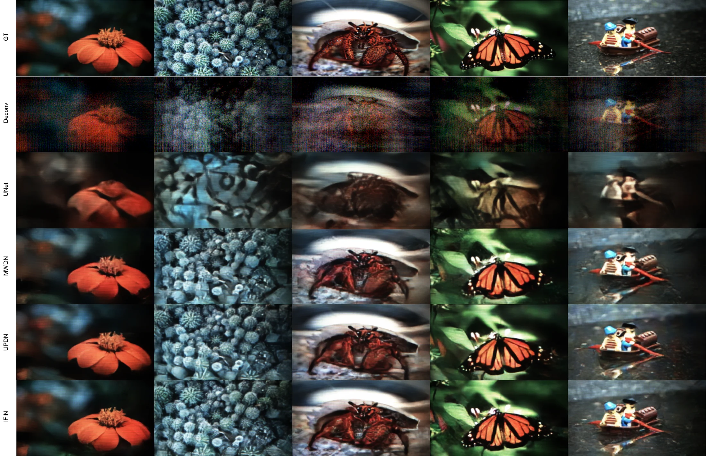

<div align="center">

# IFIN

## Integrated Forward-Inverse Network for Lensless Image Reconstruction

**Accepted to ECCV 2026**

Donggeon Bae<sup>1</sup>, Jaewoo Jung<sup>2,3</sup>, Yong Guk Kang<sup>2</sup>, Kyung Chul Lee<sup>4</sup>, Taeyoung Kim<sup>3</sup>, Jongho Kim<sup>1</sup>, Sangjun Byun<sup>1</sup>, Joonsik Park<sup>3</sup>, Seung Ah Lee<sup>1,2</sup>

<sup>1</sup>Seoul National University, Department of Mechanical Engineering<br>
<sup>2</sup>Seoul National University, School of Mechanical and Aerospace Engineering/SNU-IAMD<br>
<sup>3</sup>Yonsei University, Department of Electrical and Electronic Engineering<br>
<sup>4</sup>University of Michigan, Department of Biomedical Engineering

<p>
  <a href="https://iil-snu.github.io/IFIN/"></a>
  <a href="https://github.com/IIL-SNU/IFIN/releases/download/v0.1/ifin_eccv2026_paper.pdf"></a>
  <a href="https://github.com/IIL-SNU/IFIN/releases/download/v0.1/ifin_eccv2026_supplementary.pdf"></a>
  <a href="https://iilab.io/SVLensless-dataset"></a>
</p>



</div>

## Abstract

Lensless imaging enables compact and versatile computational cameras by replacing bulky optics with thin coded elements. However, reconstruction from the resulting measurements is challenging: large-footprint PSFs produce highly multiplexed observations, making inversion severely ill-conditioned and sensitive to calibration errors and model mismatch. We propose the **Integrated Forward-Inverse Network (IFIN)**, a physics-guided architecture that interleaves differentiable forward projections with learnable inverse updates at every stage. This bidirectional coupling supports progressive, physics-consistent refinement and permits system-constrained PSF kernel refinement under model uncertainty. On challenging lensless benchmarks, including our newly introduced **WiderCam** dataset, IFIN achieves state-of-the-art reconstruction quality. IFIN also remains effective on Gaussian deblurring and simulated inline holography, suggesting that forward-inverse interleaving can extend beyond a single lensless camera.

## Method

IFIN uses an encoder-decoder backbone with **Integrated Forward-Inverse Blocks (IFIBs)** at every scale. Each IFIB exchanges information between an image-domain stream and a measurement-domain stream using:

- **Forward System Operator (FSO):** projects the current image-domain representation through the optical forward model.
- **Inverse System Operator (ISO):** applies a learnable Wiener-like inverse update from the measurement domain.
- **Learnable PSF field:** refines system kernels end-to-end for calibration mismatch and shift-variant degradation.


## Results

IFIN improves reconstruction quality across three lensless benchmarks: DiffuserCam, WiderCam, and the MultiWienerNet dataset.

| Dataset | Metric | Previous Best | IFIN |
| --- | ---: | ---: | ---: |
| DiffuserCam | PSNR | 28.228 | **29.862** |
| DiffuserCam | LPIPS | 0.183 | **0.174** |
| DiffuserCam | SSIM | 0.878 | **0.893** |
| WiderCam | PSNR | 24.791 | **25.444** |
| WiderCam | LPIPS | 0.202 | **0.201** |
| WiderCam | SSIM | 0.810 | **0.824** |
| MultiWienerNet | PSNR | 28.504 | **31.083** |
| MultiWienerNet | LPIPS | 0.202 | **0.175** |
| MultiWienerNet | SSIM | 0.831 | **0.866** |


More qualitative results and system details are available on the [project page](https://iil-snu.github.io/IFIN/).

## WiderCam Dataset

We introduce **WiderCam**, a wide-field lensless reconstruction benchmark captured with a compact phase-mask camera. The dataset contains 25,000 paired measurements, split into 24,000 training and 1,000 test images, with strong field-dependent degradation over a wide field of view.

WiderCam is linked from the SVLensless dataset page:

**Dataset:** [https://iilab.io/SVLensless-dataset](https://iilab.io/SVLensless-dataset)

## Installation

```bash
git clone https://github.com/IIL-SNU/IFIN.git
cd IFIN
python -m venv .venv
source .venv/bin/activate
pip install -r requirements.txt
```

## Quick Start

The default configuration follows the DiffuserCam/Waller-style paired dataset layout. For a dependency and code-path smoke test without external data, switch `data.dataset` in `configs/default.yaml` to `synthetic`.

Train:

```bash
python train.py --config configs/default.yaml
```

Evaluate:

```bash
python eval.py --config configs/default.yaml --checkpoint outputs/checkpoints/ifin_last.pth
```

Run inference:

```bash
python infer.py --config configs/default.yaml --checkpoint outputs/checkpoints/ifin_last.pth
```

Run tests:

```bash
python -m pytest -q tests
```

## Dataset Layout

For DiffuserCam/Waller-style data, set `data.waller_path` and `data.psf_path` in `configs/default.yaml`.

Expected layout:

```text
dataset_root/
  dataset_train.csv
  dataset_test.csv
  diffuser_images/
  ground_truth_lensed/
  psf.tiff
```

## Citation

```bibtex
@inproceedings{bae2026ifin,
  title     = {Integrated Forward-Inverse Network for Lensless Image Reconstruction},
  author    = {Bae, Donggeon and Jung, Jaewoo and Kang, Yong Guk and Lee, Kyung Chul and Kim, Taeyoung and Kim, Jongho and Byun, Sangjun and Park, Joonsik and Lee, Seung Ah},
  booktitle = {European Conference on Computer Vision (ECCV)},
  year      = {2026}
}
```

## Contact

For other datasets, checkpoints, or additional code, please email [donggeonbae@snu.ac.kr](mailto:donggeonbae@snu.ac.kr).
